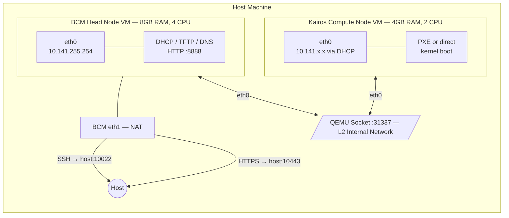
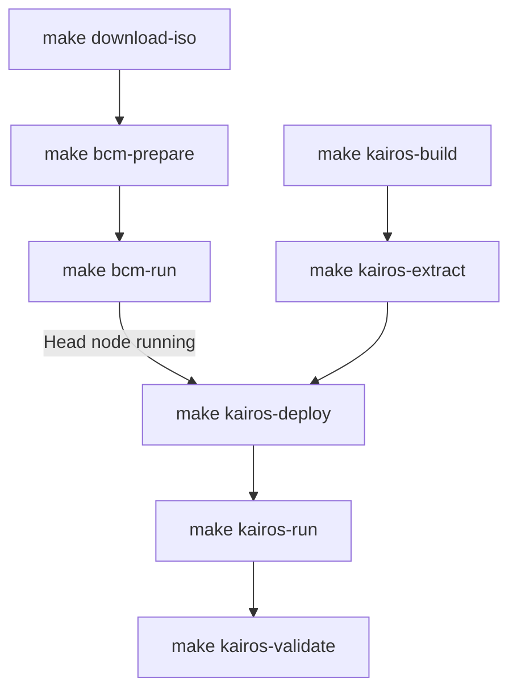
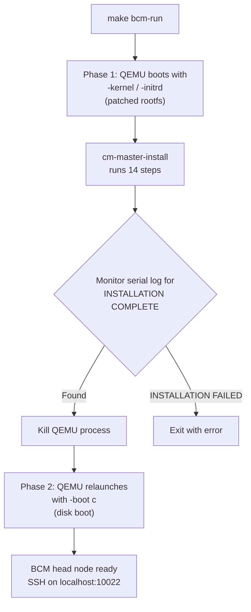
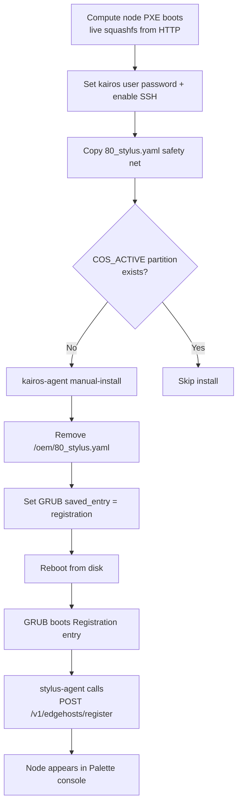

# BCM + Kairos Edge Deployment

Automated end-to-end pipeline for deploying a BCM 11.0 head node and Kairos edge compute nodes in local KVM virtual machines. Builds, installs, PXE boots, and validates the full stack — from a stock BCM ISO to a Palette-registered Kairos edge host.

## Quick Start

### 1. Setup

```bash
cp env.json.example env.json     # Create config file
# Edit env.json — fill in bcm_password, palette_token, palette_project_uid, jfrog_token
make setup                       # Verify all prerequisites are installed
```

### 2. Download BCM ISO

```bash
make download-iso                # Downloads ISO from JFrog to dist/
```

### 3. Build BCM Head Node

```bash
make bcm-prepare                 # Extract kernel + rootfs, inject auto-installer (~1 min)
make bcm-run                     # Install BCM in QEMU, auto-reboots to disk (~20 min)
```

`bcm-run` is a blocking foreground process. Monitor install progress in another terminal:

```bash
tail -f logs/bcm-serial.log      # Watch the 14-step installer
make bcm-wait                    # Or just poll until SSH is ready
```

Once SSH is available, the head node is ready. On subsequent runs, use `make bcm-start` to boot from the existing disk without reinstalling.

### 4. Build Kairos ISO

```bash
make kairos-build                # Build via CanvOS/Earthly (requires Docker, ~30-60 min)
```

### 5. Extract PXE Artifacts

```bash
make kairos-extract              # Extract kernel, initrd, squashfs + generate user-data
```

### 6. Deploy to Head Node

```bash
make kairos-deploy               # Upload PXE artifacts to BCM + start HTTP server
```

### 7. Boot Kairos Compute Node

```bash
make kairos-run                  # Launch compute node VM (direct kernel boot, blocking)
```

Monitor in another terminal:

```bash
tail -f logs/kairos-serial.log   # Watch Kairos boot + install
make kairos-wait                 # Poll until compute node SSH is reachable
```

The compute node will live-boot from squashfs, install to disk, reboot, and register with Palette.

### 8. Validate

```bash
make validate                    # Run health checks on the Kairos node via BCM head node
```

## Prerequisites

| Tool | Package | Purpose |
|------|---------|---------|
| `qemu-system-x86_64` | qemu-system-x86 | VM runtime |
| `qemu-img` | qemu-utils | Disk image creation |
| `docker` | docker.io | CanvOS ISO build |
| `jq` | jq | JSON config parsing |
| `sshpass` | sshpass | Non-interactive SSH |
| `cpio`, `gzip` | cpio, gzip | Archive manipulation |
| `mcopy`, `mkfs.vfat` | mtools, dosfstools | FAT config drive |
| `curl` | curl | ISO download |
| KVM | — | `/dev/kvm` for hardware acceleration |

Run `make setup` to verify.

## Configuration

All secrets and settings live in `env.json` (gitignored). Copy the template:

```bash
cp env.json.example env.json
```

| Field | Required | Default | Description |
|-------|----------|---------|-------------|
| `bcm_password` | Yes | — | BCM head node root password |
| `palette_token` | Yes | — | Palette edge host registration token |
| `palette_project_uid` | Yes | — | Palette project UID |
| `jfrog_token` | Yes | — | JFrog bearer token for ISO download |
| `bcm_hostname` | No | `bcm11-headnode` | Head node hostname |
| `bcm_timezone` | No | `America/Los_Angeles` | Head node timezone |
| `palette_endpoint` | No | `api.spectrocloud.com` | Palette API endpoint |
| `jfrog_instance` | No | `insightsoftmax.jfrog.io` | JFrog instance URL |
| `jfrog_repo` | No | `iso-releases` | JFrog repository name |
| `iso_filename` | No | `bcm-11.0-ubuntu2404.iso` | BCM ISO filename |

## Make Targets

```
Setup
  setup                 Check all prerequisites are installed

Download
  download-iso          Download BCM ISO from JFrog to dist/

BCM Head Node
  bcm-prepare           Prepare auto-install artifacts from ISO
  bcm-run               Auto-install + boot from disk (hands-free, blocking)
  bcm-start             Boot existing head node from disk (blocking)
  bcm-stop              Kill running BCM VM
  bcm-wait              Poll SSH until head node is ready

Kairos Build
  kairos-build          Build Kairos ISO via CanvOS (requires Docker)
  kairos-extract        Extract PXE artifacts from Kairos ISO

Kairos Deploy & Test
  kairos-deploy         Upload PXE artifacts to BCM head node
  kairos-run            Launch compute node VM (direct kernel boot, blocking)
  kairos-validate       Validate Kairos node through BCM head node
  kairos-wait           Poll until compute node is SSH-reachable

Composite
  all                   download-iso + bcm-prepare + kairos-build + kairos-extract
  test                  kairos-deploy + kairos-run
  validate              kairos-validate

Cleanup
  clean                 Remove build/ directory
  clean-bcm             Remove BCM auto-install artifacts
  clean-kairos          Remove PXE artifacts (build/pxe/)
  clean-disks           Remove all QEMU disk images
  clean-all             Remove everything including dist/
  reset                 Full clean + reset CanvOS submodule
```

## Project Structure

```
.
├── Makefile                          # Build orchestration
├── env.json.example                  # Configuration template
├── src/
│   ├── prepare-bcm-autoinstall.sh    # Patch BCM ISO for hands-free install
│   ├── launch-bcm-kvm.sh            # Launch BCM head node VM
│   ├── build-canvos.sh              # Build Kairos ISO via CanvOS/Earthly
│   ├── extract-kairos-pxe.sh        # Extract PXE artifacts + generate user-data
│   ├── test-kairos-pxe.sh           # Upload artifacts + launch compute node VM
│   ├── validate-kairos.sh           # Validate Kairos node health
│   └── canvos/
│       └── .arg.template            # CanvOS build args template
├── CanvOS/                           # Git submodule (spectrocloud/CanvOS)
├── build/                            # Generated artifacts (gitignored)
│   ├── .bcm-kernel                  # BCM installer kernel
│   ├── .bcm-rootfs-auto.cgz         # Patched BCM installer rootfs
│   ├── .bcm-init.img               # FAT config drive (password)
│   ├── bcm-disk.qcow2              # BCM head node disk
│   ├── compute-node-disk.qcow2     # Kairos compute node disk
│   ├── palette-edge-installer.iso   # Built Kairos ISO
│   └── pxe/                        # Kairos PXE boot artifacts
│       ├── vmlinuz                  # Kernel
│       ├── initrd-combined          # Initramfs + user-data overlay
│       ├── rootfs.squashfs          # Live root filesystem
│       ├── user-data.yaml           # Cloud-config
│       └── kairos-boot.ipxe         # iPXE boot script
├── dist/                             # Downloaded ISOs (gitignored)
│   └── bcm-11.0-ubuntu2404.iso
└── logs/                             # Serial console logs (gitignored)
    ├── bcm-serial.log
    └── kairos-serial.log
```

---

## Technical Details

### Architecture Overview



Two QEMU VMs connected via a socket-based L2 network on port 31337. The BCM head node listens; compute nodes connect. The head node has a second NIC with user-mode NAT for external access (SSH forwarded to host port 10022).

### Build & Deploy Pipeline



### BCM Auto-Install Pipeline

`make bcm-prepare` + `make bcm-run` automates what is normally a manual graphical install.

**Artifact preparation** (`prepare-bcm-autoinstall.sh`):

1. Mounts the stock BCM ISO and extracts the kernel and rootfs.cgz
2. Unpacks the rootfs CPIO archive
3. Patches `cm/build-config.xml` with the configured hostname and timezone
4. Injects a systemd service (`bcm-autoinstall.service`) that:
   - Conflicts with all interactive installer services (graphical, text, remote)
   - Masks getty on tty1 and ttyS0 to prevent login prompts
   - Waits for `bright-installer-configure.service` to set up the environment
   - Mounts the ISO from `/dev/sr0`
   - Runs `cm-master-install` with `--password`, `--autoreboot`, and `--mountpath`
   - Pipes `yes` to handle any unexpected prompts
5. Repacks the modified rootfs into a new CPIO/gzip archive
6. Creates a 4MB FAT config drive image containing `password.txt`

**VM launch** (`launch-bcm-kvm.sh --auto`):

The auto-install runs in two phases within a single `make bcm-run` invocation:



- **Phase 1 — Install**: QEMU boots with `-kernel`/`-initrd` (direct kernel boot from the patched rootfs). The script monitors `logs/bcm-serial.log` for `INSTALLATION COMPLETE`, then kills the QEMU process. Direct kernel boot means QEMU would re-enter the installer on reboot, so the script handles the transition.
- **Phase 2 — Disk boot**: QEMU relaunches with `-boot c`, booting from the installed disk image. The head node comes up with SSH on port 10022.

The 14-step installer takes approximately 15–20 minutes with KVM acceleration:

```
[ 1/14] Parsing build config
[ 2/14] Not mounting CD/DVD-ROM
[ 3/14] Partitioning harddrives
[ 4/14] Installing Ubuntu Server 24.04
[ 5/14] Installing head node distribution packages
[ 6/14] Installing head node BCM packages
[ 7/14] Configuring kernel and setting up bootloader
[ 8/14] Installing Ubuntu Server 24.04 base software image(s)
[ 9/14] Installing base distribution packages to software images(s)
[10/14] Installing BCM packages to software images(s)
[11/14] Installing offline selection of Python packages
[12/14] Creating node installer NFS image
[13/14] Finalizing installation
[14/14] Initializing management daemon
```

### Kairos ISO Build

`make kairos-build` wraps the [CanvOS](https://github.com/spectrocloud/CanvOS) Earthly-based build system.

The build args template at `src/canvos/.arg.template` is processed with `envsubst` and written to `CanvOS/.arg`. Any files in `src/canvos/overlay/` are copied into `CanvOS/overlay/` before the build. This keeps the CanvOS submodule clean — `make reset` restores it to upstream.

Default build configuration:

| Parameter | Value |
|-----------|-------|
| OS | Ubuntu 22.04 |
| Kubernetes | k3s |
| Registry | ttl.sh (ephemeral) |
| Architecture | amd64 |

Output: `build/palette-edge-installer.iso` (~1.6 GB)

### Kairos PXE Artifact Extraction

`make kairos-extract` takes the Kairos ISO and produces everything needed for network boot.

**Extracted from ISO**:
- `vmlinuz` — kernel from `/boot/kernel`
- `initrd` — base initramfs from `/boot/initrd`
- `rootfs.squashfs` — live root filesystem

**Generated**:
- `user-data.yaml` — cloud-config with Palette registration, auto-install, user setup
- `initrd-overlay.cgz` — CPIO archive containing user-data and a dracut pre-pivot hook
- `initrd-combined` — base initrd + overlay concatenated
- `kairos-boot.ipxe` — iPXE script for full PXE boot chain

#### User-Data Delivery (the hard part)

The `rd.cos.disable` kernel parameter is **required** for live squashfs netboot — without it, immucore conflicts with the dracut live module (`failed to resolve /run/rootfsbase`). But with `rd.cos.disable`, immucore doesn't run, which means:

- No `config_url` fetching (the normal way Kairos gets its cloud-config)
- No `/run/cos/live_mode` sentinel file (needed for boot mode detection)

The solution is a **dracut pre-pivot hook** embedded in the initrd overlay:

```
initrd-overlay.cgz contains:
  /oem/99_userdata.yaml                              # The cloud-config
  /usr/lib/dracut/hooks/pre-pivot/99-copy-oem-userdata.sh  # Hook script
```

The hook runs after the squashfs root is mounted but before `switch_root`. It:
1. Copies `/oem/99_userdata.yaml` → `/sysroot/oem/99_userdata.yaml`
2. Creates `/run/cos/live_mode` so Kairos detects it's in live boot mode
3. Creates `/sysroot/run/cos/live_mode` for post-pivot access

#### Auto-Install and Registration Flow



The user-data configures this multi-stage boot process:

1. **Boot stage** (live boot, before install):
   - Sets kairos user password and enables SSH
   - Copies `80_stylus.yaml` safety net (prevents crash loops if missing)
   - Runs `kairos-agent manual-install` if no `COS_ACTIVE` partition exists

2. **After-install stage** (runs once after install completes):
   - Removes `/oem/80_stylus.yaml` so stylus-agent enters registration mode
   - Sets GRUB saved entry to `registration` for first disk boot

3. **First disk boot**:
   - GRUB boots the "Registration" entry (adds `stylus.registration` to kernel cmdline)
   - stylus-agent detects registration mode, calls `POST /v1/edgehosts/register`
   - Node appears in Palette console as a registered edge host

### Kairos Deployment and Testing

`make kairos-deploy` uploads artifacts to the BCM head node via SCP and starts a Python HTTP server:

```
BCM Head Node (/tftpboot/kairos/):
  vmlinuz
  initrd              (initrd-combined)
  rootfs.squashfs
  user-data.yaml
  kairos-boot.ipxe

HTTP server: python3 -m http.server 8888 --bind 10.141.255.254
```

`make kairos-run` launches the compute node VM in **direct kernel boot** mode — QEMU loads the kernel and initrd directly, bypassing the iPXE chain. Kernel parameters tell dracut to fetch the squashfs over HTTP:

```
rd.neednet=1 ip=dhcp rd.cos.disable
root=live:http://10.141.255.254:8888/kairos/rootfs.squashfs
rd.live.dir=/ rd.live.squashimg=rootfs.squashfs
config_url=http://10.141.255.254:8888/kairos/user-data.yaml
rd.immucore.sysrootwait=600
```

The compute node gets a DHCP address from the BCM head node on the 10.141.0.0/16 internal network, boots into live mode, installs to disk, and reboots into registration mode.

### Validation

`make validate` SSHes through the BCM head node to the compute node (auto-detected via DHCP leases) and checks:

- **OS & Kairos**: OS release, kairos-agent binary, immucore version
- **Kernel & Boot**: Kernel version, boot parameters, squashfs mount
- **Services**: k3s, kairos-agent, stylus-agent status, SSH, networking

### Network Details

| Network | Subnet | Purpose |
|---------|--------|---------|
| Internal (socket :31337) | 10.141.0.0/16 | Cluster network between head + compute nodes |
| External (QEMU NAT) | 10.0.2.0/24 | Head node internet access, SSH from host |

| Port | Host | VM | Service |
|------|------|----|---------|
| 10022 | localhost | BCM:22 | SSH |
| 10443 | localhost | BCM:443 | HTTPS (BCM web UI) |
| 8888 | — | BCM internal | HTTP (PXE artifacts) |
| 31337 | — | — | QEMU socket (L2 bridge) |

### Known Issues

- **Palette rate limiting**: If stylus-agent crash-loops (e.g., missing `/oem/80_stylus.yaml`), it can trigger nginx-level 429 rate limits on the Palette API that persist for 10+ minutes. The user-data includes a safety net that copies `80_stylus.yaml` if missing.
- **Direct kernel boot reboot**: QEMU with `-kernel`/`-initrd` always re-enters the installer on VM reboot. `launch-bcm-kvm.sh --auto` handles this automatically by stopping and relaunching from disk.
- **Partition sizing**: The Kairos installer may double some partition sizes internally. Ensure the compute node disk is large enough (default: 80G).
