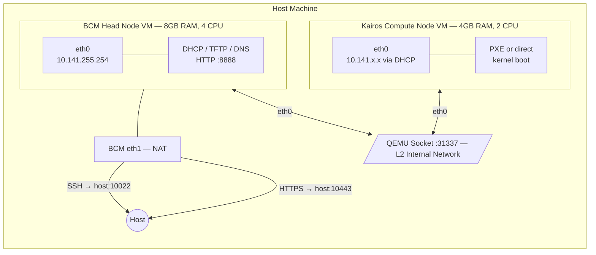
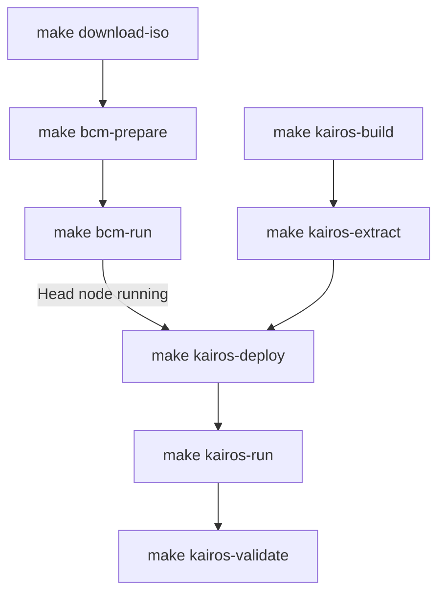
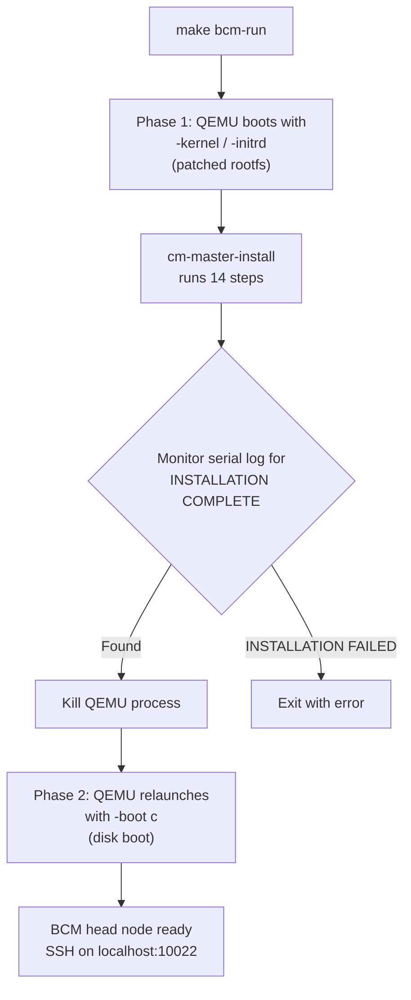
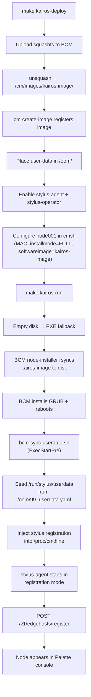

# BCM + Kairos Edge Deployment

Automated end-to-end pipeline for deploying a BCM 11.0 head node and Kairos edge compute nodes in local KVM virtual machines. Builds, installs, PXE boots, and validates the full stack — from a stock BCM ISO to a Palette-registered Kairos edge host.

## Quick Start

### 1. Setup

```bash
git submodule update --init --recursive  # Initialize submodules (CanvOS, etc.)
cp env.json.example env.json             # Create config file
# Edit env.json — fill in bcm_password, palette_token, palette_project_uid, jfrog_token
make setup                               # Verify all prerequisites are installed
```

### 2. Full End-to-End Sequence

```bash
# Clean slate
make clean-all

# Download ISO
make download-iso                # Download BCM ISO from JFrog (~2 GB)

# Build + install BCM head node
make bcm-prepare                 # Extract kernel + rootfs, inject auto-installer (~1 min)
make bcm-run                     # Install BCM, reboot to disk, return when SSH ready (~20 min)

# Build Kairos image
make kairos-build                # Build via CanvOS/Earthly (requires Docker, ~30-60 min)
make kairos-extract              # Extract squashfs + generate user-data

# Deploy to head node + boot compute node
make kairos-deploy               # Upload squashfs to BCM, register image, configure node001
make kairos-run                  # Launch compute VM, return when provisioned + SSH ready (~5 min)

# Validate
make validate                    # Run health checks on the Kairos node via BCM head node

# Teardown
make kairos-stop                 # Kill compute node VM
make bcm-stop                    # Kill head node VM
make clean-all                   # Remove all build artifacts + downloaded ISOs
```

`bcm-run` and `kairos-run` run QEMU in the background and return when SSH is ready. `kairos-build` + `kairos-extract` can run in parallel with `bcm-prepare` + `bcm-run` in a separate terminal to save time.

On subsequent runs, use `make bcm-start` to boot the head node from its existing disk without reinstalling.

### 3. One-Command Orchestration

```bash
make orchestrate
```

Runs the entire pipeline as a parallel DAG — both build tracks execute simultaneously, then deploy, provision, and validate run in sequence. A compact rolling status display shows the last 5 lines of each step's log, refreshing every 5 seconds.

```
DAG:
  clean-all ──┬── download-iso → bcm-prepare → bcm-run ──┐
              │                                           ├── kairos-deploy → kairos-run → validate
              └── kairos-build → kairos-extract ──────────┘
```

All output is logged to `./logs/orchestrate-<step>.log`. On Ctrl+C, the script traps the signal and cleans up all child processes and QEMU VMs.

## Prerequisites

| Tool | Package | Purpose |
|------|---------|---------|
| `qemu-system-x86_64` | qemu-system-x86 | VM runtime |
| `qemu-img` | qemu-utils | Disk image creation |
| `docker` | docker.io | CanvOS ISO build |
| `jq` | jq | JSON config parsing |
| `sshpass` | sshpass | Non-interactive SSH |
| `cpio`, `gzip` | cpio, gzip | Archive manipulation |
| `mcopy`, `mkfs.vfat` | mtools, dosfstools | FAT config drive |
| `curl` | curl | ISO download |
| KVM | — | `/dev/kvm` for hardware acceleration |

Run `make setup` to verify.

## Configuration

All secrets and settings live in `env.json` (gitignored). Copy the template:

```bash
cp env.json.example env.json
```

| Field | Required | Default | Description |
|-------|----------|---------|-------------|
| `bcm_password` | Yes | — | BCM head node root password |
| `palette_token` | Yes | — | Palette edge host registration token |
| `palette_project_uid` | Yes | — | Palette project UID |
| `jfrog_token` | Yes | — | JFrog bearer token for ISO download |
| `bcm_hostname` | No | `bcm11-headnode` | Head node hostname |
| `bcm_timezone` | No | `America/Los_Angeles` | Head node timezone |
| `palette_endpoint` | No | `api.spectrocloud.com` | Palette API endpoint |
| `jfrog_instance` | No | `insightsoftmax.jfrog.io` | JFrog instance URL |
| `jfrog_repo` | No | `iso-releases` | JFrog repository name |
| `iso_filename` | No | `bcm-11.0-ubuntu2404.iso` | BCM ISO filename |

## Make Targets

Targets are listed in the order they would typically be run during a full end-to-end deployment.

### Setup & Download

| Target | Description |
|--------|-------------|
| `make setup` | Verifies all required tools are installed (`jq`, `qemu`, `docker`, `sshpass`, `mtools`, etc.) and checks for `env.json` and the CanvOS submodule. Run this first. |
| `make download-iso` | Downloads the BCM ISO from JFrog using the token in `env.json`. Saves to `dist/`. Skips if ISO already exists. |

### BCM Head Node

| Target | Description |
|--------|-------------|
| `make bcm-prepare` | Extracts kernel and rootfs from the BCM ISO, patches `build-config.xml`, injects the auto-install systemd service, repacks the rootfs, and creates a FAT config drive with the password. Outputs to `build/.bcm-*`. Takes ~1 minute. |
| `make bcm-run` | Launches the BCM head node VM with fully automated installation. Runs in two phases: Phase 1 boots the patched installer via direct kernel boot and monitors the serial log for completion (14 steps, ~20 min). Phase 2 kills the installer VM and relaunches from the installed disk. Blocking. |
| `make bcm-start` | Boots the BCM head node from an existing disk image (`build/bcm-disk.qcow2`). Use this after the initial install to restart the head node without reinstalling. Blocking. |
| `make bcm-stop` | Kills the running BCM head node QEMU process. |
| `make bcm-wait` | Polls SSH on `localhost:10022` every 10 seconds until the head node is reachable. Shows elapsed time. Run in a separate terminal while `bcm-run` or `bcm-start` is running. |

### Kairos Build & Extract

| Target | Description |
|--------|-------------|
| `make kairos-build` | Builds the Kairos edge installer ISO using the CanvOS Earthly build system. Generates `.arg` from `src/canvos/.arg.template`, copies any custom overlay files, and runs `earthly.sh +iso`. Requires Docker. Output: `build/palette-edge-installer.iso` (~1.6 GB). Takes 30–60 minutes. |
| `make kairos-extract` | Mounts the Kairos ISO and extracts PXE boot artifacts (kernel, initrd, squashfs). Generates `user-data.yaml` with Palette registration config, builds a dracut pre-pivot hook overlay, and combines it into `initrd-combined`. Outputs to `build/pxe/`. Takes ~5 minutes. |

### Kairos Deploy & Test

| Target | Description |
|--------|-------------|
| `make kairos-deploy` | Uploads the squashfs to the BCM head node, extracts it as `/cm/images/kairos-image/`, registers it via `cm-create-image`, places user-data, enables Palette services, and configures `node001` in cmsh with the compute node MAC and `installmode=FULL`. Requires BCM head node to be running. |
| `make kairos-run` | Launches a Kairos compute node VM connected to the BCM internal network. BCM PXE boots the node, rsyncs the image to disk, installs GRUB, and reboots. On first disk boot, `stylus-agent` registers with Palette. Blocking. |
| `make kairos-wait` | Polls the BCM head node's DHCP leases for a compute node IP, then polls SSH to that node until it's reachable. Shows elapsed time. Run in a separate terminal while `kairos-run` is running. |
| `make kairos-validate` | SSHes through the BCM head node to the compute node (auto-detected via DHCP leases) and runs health checks: OS release, kairos-agent, kernel params, squashfs mount, k3s, stylus-agent status, and networking. |

### Composite

| Target | Description |
|--------|-------------|
| `make all` | Runs the full build pipeline: `download-iso` → `bcm-prepare` → `kairos-build` → `kairos-extract`. Does not launch any VMs. |
| `make test` | Deploys and boots a Kairos compute node: `kairos-deploy` → `kairos-run`. Requires BCM head node to be running. |
| `make validate` | Alias for `kairos-validate`. |
| `make orchestrate` | Runs the entire pipeline as a parallel DAG: clean → build (two parallel tracks) → deploy → provision → validate. Shows rolling status display. Traps Ctrl+C to clean up all child processes and VMs. |

### Cleanup

| Target | Description |
|--------|-------------|
| `make clean` | Removes the entire `build/` directory (Kairos ISO, PXE artifacts, auto-install artifacts). |
| `make clean-bcm` | Removes only the BCM auto-install artifacts (`build/.bcm-kernel`, `.bcm-rootfs-auto.cgz`, `.bcm-init.img`). |
| `make clean-kairos` | Removes the Kairos ISO and PXE artifacts (`build/pxe/`, `build/palette-edge-installer.iso`). |
| `make clean-disks` | Removes all QEMU disk images (`build/*.qcow2`). |
| `make clean-all` | Runs `clean` + `clean-bcm` + `clean-disks` and also removes `dist/` (downloaded ISOs). |
| `make reset` | Runs `clean-all` then resets the CanvOS submodule to upstream (`git checkout . && git clean -fdx`). |

## Project Structure

```
.
├── Makefile                          # Build orchestration
├── env.json.example                  # Configuration template
├── src/
│   ├── prepare-bcm-autoinstall.sh    # Patch BCM ISO for hands-free install
│   ├── launch-bcm-kvm.sh            # Launch BCM head node VM
│   ├── build-canvos.sh              # Build Kairos ISO via CanvOS/Earthly
│   ├── extract-kairos-pxe.sh        # Extract PXE artifacts + generate user-data
│   ├── test-kairos-pxe.sh           # Upload artifacts + launch compute node VM
│   ├── validate-kairos.sh           # Validate Kairos node health
│   ├── orchestrate.sh               # Full pipeline as parallel DAG
│   └── canvos/
│       ├── .arg.template            # CanvOS build args template
│       └── overlay/                 # Custom files copied into CanvOS overlay at build time
│           └── files/usr/local/bin/
│               ├── bcm-sync-userdata.sh   # Seeds userdata + registration mode (ExecStartPre)
│               └── bcm-compat-fixes.sh    # Boot-time BCM compatibility fixes
├── CanvOS/                           # Git submodule (spectrocloud/CanvOS)
├── build/                            # Generated artifacts (gitignored)
│   ├── .bcm-kernel                  # BCM installer kernel
│   ├── .bcm-rootfs-auto.cgz         # Patched BCM installer rootfs
│   ├── .bcm-init.img               # FAT config drive (password)
│   ├── bcm-disk.qcow2              # BCM head node disk
│   ├── compute-node-disk.qcow2     # Kairos compute node disk
│   ├── palette-edge-installer.iso   # Built Kairos ISO
│   └── pxe/                        # Kairos PXE boot artifacts
│       ├── vmlinuz                  # Kernel
│       ├── initrd-combined          # Initramfs + user-data overlay
│       ├── rootfs.squashfs          # Live root filesystem
│       ├── user-data.yaml           # Cloud-config
│       └── kairos-boot.ipxe         # iPXE boot script
├── dist/                             # Downloaded ISOs (gitignored)
│   └── bcm-11.0-ubuntu2404.iso
└── logs/                             # Serial console logs (gitignored)
    ├── bcm-serial.log
    └── kairos-serial.log
```

---

## Technical Details

### Architecture Overview



Two QEMU VMs connected via a socket-based L2 network on port 31337. The BCM head node listens; compute nodes connect. The head node has a second NIC with user-mode NAT for external access (SSH forwarded to host port 10022).

### Build & Deploy Pipeline



### BCM Auto-Install Pipeline

`make bcm-prepare` + `make bcm-run` automates what is normally a manual graphical install.

**Artifact preparation** (`prepare-bcm-autoinstall.sh`):

1. Mounts the stock BCM ISO and extracts the kernel and rootfs.cgz
2. Unpacks the rootfs CPIO archive
3. Patches `cm/build-config.xml` with the configured hostname and timezone
4. Injects a systemd service (`bcm-autoinstall.service`) that:
   - Conflicts with all interactive installer services (graphical, text, remote)
   - Masks getty on tty1 and ttyS0 to prevent login prompts
   - Waits for `bright-installer-configure.service` to set up the environment
   - Mounts the ISO from `/dev/sr0`
   - Runs `cm-master-install` with `--password`, `--autoreboot`, and `--mountpath`
   - Pipes `yes` to handle any unexpected prompts
5. Repacks the modified rootfs into a new CPIO/gzip archive
6. Creates a 4MB FAT config drive image containing `password.txt`

**VM launch** (`launch-bcm-kvm.sh --auto`):

The auto-install runs in two phases within a single `make bcm-run` invocation:



- **Phase 1 — Install**: QEMU boots with `-kernel`/`-initrd` (direct kernel boot from the patched rootfs). The script monitors `logs/bcm-serial.log` for `INSTALLATION COMPLETE`, then kills the QEMU process. Direct kernel boot means QEMU would re-enter the installer on reboot, so the script handles the transition.
- **Phase 2 — Disk boot**: QEMU relaunches with `-boot c`, booting from the installed disk image. The head node comes up with SSH on port 10022.

The 14-step installer takes approximately 15–20 minutes with KVM acceleration:

```
[ 1/14] Parsing build config
[ 2/14] Not mounting CD/DVD-ROM
[ 3/14] Partitioning harddrives
[ 4/14] Installing Ubuntu Server 24.04
[ 5/14] Installing head node distribution packages
[ 6/14] Installing head node BCM packages
[ 7/14] Configuring kernel and setting up bootloader
[ 8/14] Installing Ubuntu Server 24.04 base software image(s)
[ 9/14] Installing base distribution packages to software images(s)
[10/14] Installing BCM packages to software images(s)
[11/14] Installing offline selection of Python packages
[12/14] Creating node installer NFS image
[13/14] Finalizing installation
[14/14] Initializing management daemon
```

### Kairos ISO Build

`make kairos-build` wraps the [CanvOS](https://github.com/spectrocloud/CanvOS) Earthly-based build system.

The build args template at `src/canvos/.arg.template` is processed with `envsubst` and written to `CanvOS/.arg`. Any files in `src/canvos/overlay/` are copied into `CanvOS/overlay/` before the build. This keeps the CanvOS submodule clean — `make reset` restores it to upstream.

Default build configuration:

| Parameter | Value |
|-----------|-------|
| OS | Ubuntu 22.04 |
| Kubernetes | k3s |
| Registry | ttl.sh (ephemeral) |
| Architecture | amd64 |

Output: `build/palette-edge-installer.iso` (~1.6 GB)

### Kairos PXE Artifact Extraction

`make kairos-extract` takes the Kairos ISO and produces everything needed for network boot.

**Extracted from ISO**:
- `vmlinuz` — kernel from `/boot/kernel`
- `initrd` — base initramfs from `/boot/initrd`
- `rootfs.squashfs` — live root filesystem

**Generated**:
- `user-data.yaml` — cloud-config with Palette registration, auto-install, user setup
- `initrd-overlay.cgz` — CPIO archive containing user-data and a dracut pre-pivot hook
- `initrd-combined` — base initrd + overlay concatenated
- `kairos-boot.ipxe` — iPXE script for full PXE boot chain

#### User-Data Delivery (the hard part)

The `rd.cos.disable` kernel parameter is **required** for live squashfs netboot — without it, immucore conflicts with the dracut live module (`failed to resolve /run/rootfsbase`). But with `rd.cos.disable`, immucore doesn't run, which means:

- No `config_url` fetching (the normal way Kairos gets its cloud-config)
- No `/run/cos/live_mode` sentinel file (needed for boot mode detection)

The solution is a **dracut pre-pivot hook** embedded in the initrd overlay:

```
initrd-overlay.cgz contains:
  /oem/99_userdata.yaml                              # The cloud-config
  /usr/lib/dracut/hooks/pre-pivot/99-copy-oem-userdata.sh  # Hook script
```

The hook runs after the squashfs root is mounted but before `switch_root`. It:
1. Copies `/oem/99_userdata.yaml` → `/sysroot/oem/99_userdata.yaml`
2. Creates `/run/cos/live_mode` so Kairos detects it's in live boot mode
3. Creates `/sysroot/run/cos/live_mode` for post-pivot access

#### BCM Provisioning and Registration Flow



BCM handles all disk provisioning — no live boot, no `kairos-agent install`, no dracut hooks:

1. **Deploy** (`make kairos-deploy`):
   - Uploads squashfs and extracts it as a BCM software image
   - `cm-create-image` registers the image and installs BCM node packages
   - Places `user-data.yaml` in `/oem/` with Palette registration config
   - Enables `stylus-agent` and `stylus-operator` systemd services
   - Configures `node001` in cmsh with `installmode=FULL`

2. **Provisioning** (`make kairos-run`):
   - Compute node VM boots with empty disk → falls through to PXE
   - BCM's node-installer rsyncs the image to disk and installs GRUB
   - Node reboots from disk into the Kairos image

3. **Registration** (automatic on first disk boot):
   - `bcm-sync-userdata.sh` (ExecStartPre) seeds `/run/stylus/userdata` from `/oem/99_userdata.yaml`
   - Detects unregistered node, injects `stylus.registration` into `/proc/cmdline` via bind mount
   - `stylus-agent` reads the `edgeHostToken`, enters registration mode
   - Calls `POST /v1/edgehosts/register` — node appears in Palette console

### Kairos Deployment and Testing

`make kairos-deploy` uploads the squashfs to the BCM head node and configures it as a BCM software image:

1. SCPs `rootfs.squashfs` to the head node and extracts it to `/cm/images/kairos-image/`
2. Runs `cm-create-image` to register the image and install BCM node packages
3. Places `user-data.yaml` in `/oem/` and enables Palette services
4. Configures `node001` in cmsh (`MAC`, `installmode=FULL`, `softwareimage=kairos-image`)
5. Waits for BCM to generate the node ramdisk

`make kairos-run` launches the compute node VM on the BCM internal network. Boot order is disk first, network fallback:

- **First boot**: empty disk → PXE fallback → BCM provisions the image to disk via rsync → installs GRUB → reboots
- **Subsequent boots**: boots from disk into Kairos

The compute node gets a DHCP address from BCM on the 10.141.0.0/16 internal network. On first disk boot, `bcm-sync-userdata.sh` seeds `/run/stylus/userdata` and injects `stylus.registration` into the kernel cmdline, allowing `stylus-agent` to register with Palette.

### Validation

`make validate` SSHes through the BCM head node to the compute node (auto-detected via DHCP leases) and checks:

- **OS & Kairos**: OS release, kairos-agent binary, immucore version
- **Kernel & Boot**: Kernel version, boot parameters, squashfs mount
- **Services**: k3s, kairos-agent, stylus-agent status, SSH, networking

### Network Details

| Network | Subnet | Purpose |
|---------|--------|---------|
| Internal (socket :31337) | 10.141.0.0/16 | Cluster network between head + compute nodes |
| External (QEMU NAT) | 10.0.2.0/24 | Head node internet access, SSH from host |

| Port | Host | VM | Service |
|------|------|----|---------|
| 10022 | localhost | BCM:22 | SSH |
| 10443 | localhost | BCM:443 | HTTPS (BCM web UI) |
| 8888 | — | BCM internal | HTTP (PXE artifacts) |
| 31337 | — | — | QEMU socket (L2 bridge) |

### Known Issues

- **Palette rate limiting**: If `stylus-agent` starts without `/run/stylus/userdata`, it skips registration and hammers the login endpoint, triggering 429 rate limits that persist for 10+ minutes. The `bcm-sync-userdata.sh` ExecStartPre script prevents this by seeding the userdata file before the agent starts.
- **Direct kernel boot reboot**: QEMU with `-kernel`/`-initrd` always re-enters the installer on VM reboot. `launch-bcm-kvm.sh --auto` handles this automatically by stopping and relaunching from disk.
- **Partition sizing**: The Kairos installer may double some partition sizes internally. Ensure the compute node disk is large enough (default: 80G).
